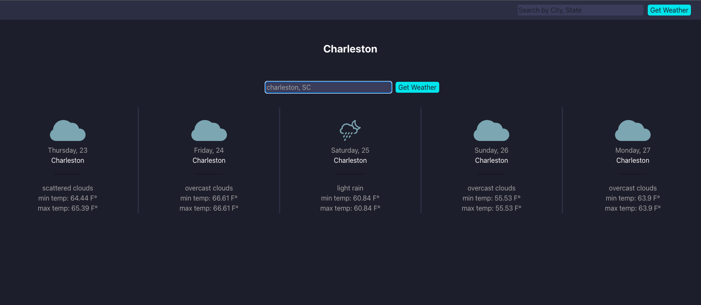

# A React + JS weather app

Created this project to learn how to use React as well as for an interview. In the process had to both learn React and build app, was given 1 week to complete. Met all requirements. This is the first complete version, for the sake of practice will try to improve it more from here.

I'm using the api from [open weather map](https://openweathermap.org). 1000 api calls per day for free version.

I've added a sample config file [here](src/set_config.js), but you'll have to rename to 'config.js', add your api key, than everything should work.

# Getting Started with Create React App

This project was bootstrapped with [Create React App](https://github.com/facebook/create-react-app).

## Available Scripts

In the project directory, you can run:

### `npm start`

Runs the app in the development mode.\
Open [http://localhost:3000](http://localhost:3000) to view it in your browser.

The page will reload when you make changes.\
You may also see any lint errors in the console.

### `npm test`

Launches the test runner in the interactive watch mode.\
See the section about [running tests](https://facebook.github.io/create-react-app/docs/running-tests) for more information.

### `npm run build`

Builds the app for production to the `build` folder.\
It correctly bundles React in production mode and optimizes the build for the best performance.

The build is minified and the filenames include the hashes.\
Your app is ready to be deployed!

See the section about [deployment](https://facebook.github.io/create-react-app/docs/deployment) for more information.

